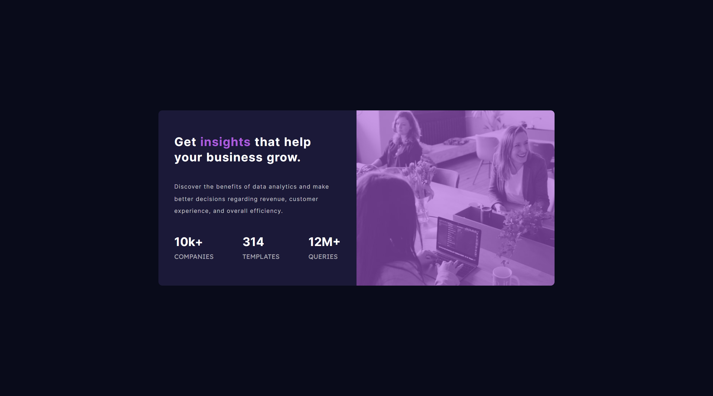

# Frontend Mentor - Stats preview card component solution

This is a solution to the [Stats preview card component challenge on Frontend Mentor](https://www.frontendmentor.io/challenges/stats-preview-card-component-8JqbgoU62). Frontend Mentor challenges help you improve your coding skills by building realistic projects.

## Table of contents

- [Overview](#overview)
  - [The challenge](#the-challenge)
  - [Screenshot](#screenshot)
  - [Links](#links)
- [My process](#my-process)
  - [Built with](#built-with)
  - [What I learned](#what-i-learned)
  - [Continued development](#continued-development)
  - [Useful resources](#useful-resources)
- [Author](#author)
- [Acknowledgments](#acknowledgments)

## Overview

Joined the work of this cool author [Kevin Powell](https://www.youtube.com/watch?v=B2WL6KkqhLQ&ab_channel=KevinPowell), this is the same video that made me decide to get back into the hobby again and links to [Twitter](https://twitter.com/KevinJPowell)
[Codepen](https://codepen.io/kevinpowell/)
[Github](https://github.com/kevin-powell)

### The challenge

Users should be able to:

- View the optimal layout depending on their device's screen size

### Screenshot

### Links

- Solution URL: [GitHub](https://github.com/sledua/fm-stats-preview-card-component)
- Live Site URL: [Live site](https://lustrous-zuccutto-68f3eb.netlify.app/)

## My process

### Built with

- Semantic HTML5 markup
- CSS custom properties
- Flexbox
- CSS Grid
- Mobile-first workflow

### What I learned

HTML & CSS (flex and grid)

### Continued development

Hard work and fun

### Useful resources

[Kevin Powell](https://www.youtube.com/watch?v=B2WL6KkqhLQ&ab_channel=KevinPowell), [Twitter](https://twitter.com/KevinJPowell),
[Codepen](https://codepen.io/kevinpowell/),
[Github](https://github.com/kevin-powell).

## Author

- Website - [Art Sled](https://github.com/sledua)
- Frontend Mentor - [@sledua](https://www.frontendmentor.io/profile/sledua)

## Acknowledgments

This is where you can give a hat tip to anyone who helped you out on this project. Perhaps you worked in a team or got some inspiration from someone else's solution. This is the perfect place to give them some credit.